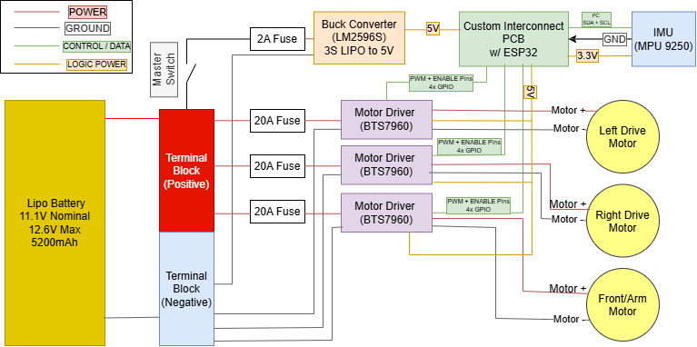
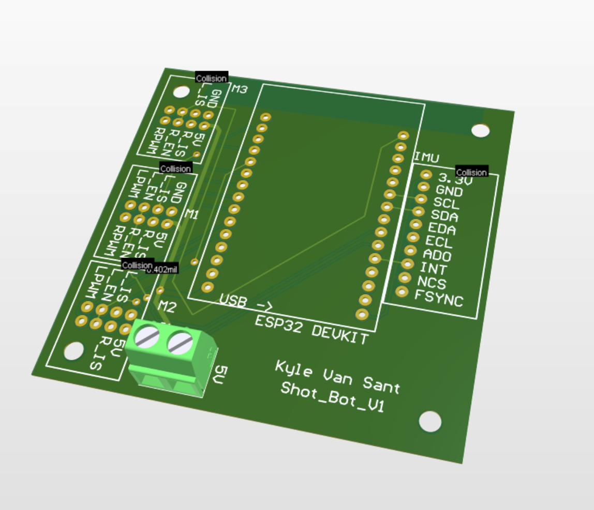

# ShotBot

**Stair-Climbing Robotic Delivery Platform**  
Developed through the Stanford Moonshot Club

ShotBot is a team-developed mechatronics project focused on building a mobile delivery robot capable of traversing stairs. The project began as a broader autonomous-delivery concept, originally called **SCARD — Stair Climbing Autonomous Robot Delivery**, and evolved into a working prototype centered on the core mechanical and electrical challenges of stair climbing.

The completed platform combines a tracked drivetrain, an articulated front stair-climbing mechanism, custom mechanical components, a custom electrical interconnect PCB, and ESP32-based motor control. The final prototype is operated with a Bluetooth gamepad and demonstrates controlled driving and functional stair climbing. Autonomous navigation, LiDAR-based perception, and additional sensing were investigated during development but were not integrated into the final operating system.

The repository documents the full engineering process, including mechanical design, electrical architecture, embedded firmware, design references, prototype testing, and development history.

## Demonstration

The final prototype successfully demonstrated the primary goal of the project: climbing a staircase using its tracked drivetrain and articulated front mechanism.

[**Watch the final stair-climbing demonstration**](media/Videos/Climbing/Final_Stair_Climb_Web.mp4)

Additional development and testing footage is available in the [`media/`](media/) directory.

## Mechanical Design

The mechanical system was designed primarily in Autodesk Fusion 360. ShotBot uses a tracked drivetrain together with an articulated front mechanism intended to improve engagement with stair surfaces and assist the robot during transitions onto and off of a staircase.

Mechanical development included the main chassis, drivetrain components, sprockets, tread elements, motor mounts, front flipper components, sensor mounting concepts, and multiple design revisions retained in the repository to document the evolution of the system.

The repository includes native Fusion 360 assembly files, STEP exports, custom-part models, and rendered views of the completed assembly.

For detailed mechanical documentation, see the [`cad/`](cad/) directory.

## Electrical System

ShotBot is powered by a 3S LiPo battery and uses three independent BTS7960 motor-driver channels controlled by an ESP32 DevKit. The electrical system separates the high-current motor-power paths from the low-voltage control electronics and uses individually fused branches for the major loads.

The system was developed incrementally, beginning with breadboard-based integration and subsystem testing before being consolidated into a custom interconnect PCB designed in Altium Designer. The final PCB was fabricated, installed on the robot, and used successfully during operation.

The electrical architecture above shows the relationship between the battery, fused power-distribution branches, buck-converted logic supply, ESP32 controller, motor drivers, and sensor interfaces used in the final prototype.

The custom PCB organizes the interfaces between the ESP32, motor drivers, IMU, and low-voltage power system while reducing point-to-point wiring in the final prototype.

For schematics, PCB source files, Gerbers, photographs, and additional electrical documentation, see the [`electrical/`](electrical/) directory.

## Firmware and Control

The final robot is controlled by an ESP32 using firmware written with the Arduino framework. Bluetooth gamepad support is provided through Bluepad32.

The firmware independently controls the left drivetrain motor, right drivetrain motor, and front stair-climbing motor through three BTS7960 H-bridges. Tank-style joystick control is used for the drivetrain, while the front mechanism is controlled independently from the gamepad shoulder buttons.

The final control software also includes PWM output limits, joystick deadzone handling, motor-driver enable control, and controller-disconnect fail-safe behavior. The firmware in the repository is the integrated code used on the working prototype rather than the temporary subsystem-test sketches used during development.

For the final control code and implementation details, see the [`firmware/`](firmware/) directory.

## Testing and Prototype Development

ShotBot was developed through repeated subsystem and integration testing rather than as a single final build. Testing included individual motor operation, tread behavior, drivetrain motion, front-mechanism control, electrical integration, controller operation, sensor experiments, and stair-climbing trials.

The [`media/`](media/) directory contains video documentation from these stages of development. This footage is retained to show the progression from early component testing through the completed stair-climbing prototype.

The [`tests/`](tests/) directory is reserved for project testing documentation and related material.

## Project Documentation

Supporting project records are maintained in the [`docs/`](docs/) directory. These include the project bill of materials, the original SCARD project pitch, and technical references used during development.

One of the primary design references was the 2023 IEEE Access review *Stair-climbing Robots: a Review on Mechanism, Sensing, and Performance Evaluation*. Its discussion of tracked stair-climbing architectures and articulated flippers helped inform the team's investigation of a tracked platform with a front articulated mechanism.

The original SCARD presentation is retained as historical documentation because it captures the initial project goals, including autonomous navigation, LiDAR sensing, camera integration, stair climbing, and delivery functionality. The final ShotBot prototype intentionally represents a narrower completed scope focused on the mechanical platform, electrical integration, embedded motor control, and reliable stair-climbing operation.

## Repository Organization

The major project sections are organized as follows:

- [`cad/`](cad/) — mechanical CAD, custom parts, assembly files, and renders
- [`electrical/`](electrical/) — electrical architecture, PCB design, fabrication files, and physical implementation
- [`firmware/`](firmware/) — final ESP32 control firmware and control-system documentation
- [`docs/`](docs/) — project records, bill of materials, original pitch, and design references
- [`media/`](media/) — development, testing, and final demonstration footage
- [`tests/`](tests/) — testing documentation and related material

Each major engineering section contains its own README with more detailed technical documentation.

## Team

ShotBot was developed as a team project through the Stanford Moonshot Club.

- **Kyle Van Sant** — Project Lead
- **Joshua Nangle** — Mechanical Lead
- **Gabriel Irazabal** — Electrical Lead
- **Griffin Wright** — Dynamics & Analysis Lead

## Project Status

ShotBot reached the working-prototype stage as a remotely controlled stair-climbing delivery platform. The completed system demonstrated integrated mechanical, electrical, and embedded-control functionality, including independent drivetrain control, operation of the front stair-climbing mechanism, and successful stair traversal.

More advanced autonomy concepts were explored during the project, including LiDAR, IMU feedback, and sensor mounting, but were not incorporated into the final operating prototype.

## Development History

The project began as **SCARD — Stair Climbing Autonomous Robot Delivery**, a concept for a delivery robot intended to combine autonomous navigation with the ability to move between floors using conventional stairs.

Early development focused on understanding existing stair-climbing robot architectures and identifying a mechanism that could be manufactured within the team's available resources. Research into tracked robots and articulated flipper systems helped guide the mechanical direction of the project.

From there, development progressed through mechanical CAD and prototype fabrication, drivetrain and tread testing, electrical breadboarding, ESP32 motor-control development, custom PCB design, controller integration, and full-system testing. LiDAR and IMU hardware were also investigated as part of the original sensing and autonomy direction.

As the project matured, the team narrowed the final scope to prioritize completion of a reliable physical platform. The resulting ShotBot prototype used Bluetooth teleoperation rather than autonomous navigation, while retaining the tracked stair-climbing architecture and integrated electrical system developed through the project.

The final stage of development demonstrated the complete robot driving under remote control and successfully climbing stairs, validating the primary mechanical objective that motivated the project.
