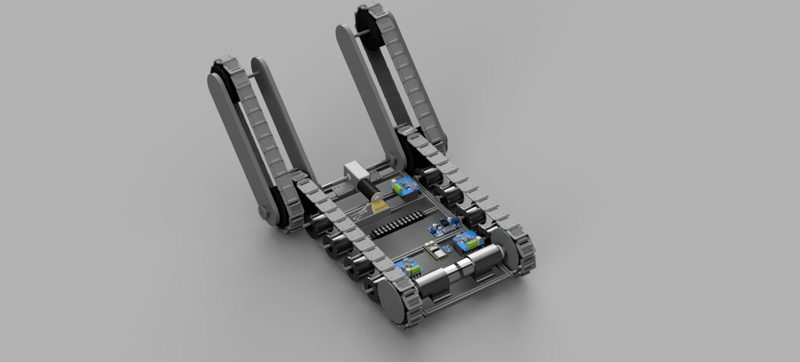

# ShotBot CAD

This directory contains the mechanical design files for **ShotBot**, a stair-climbing delivery robot developed through the Stanford Moonshot Club.

The mechanical system was designed primarily in Autodesk Fusion 360 and developed through repeated prototyping and testing. The final architecture uses a tracked differential-drive base combined with a pair of articulated tracked front flippers. The flippers are mechanically synchronized and are used to control how the robot engages with and transitions onto stairs.

Native Fusion 360 assemblies, STEP exports, custom part files, and rendered views are included to document both the final configuration and the design iterations that led to it.

## Main Assembly

The final mechanical assembly combines three major subsystems:

- A left and right tracked drivetrain for normal driving and differential steering
- Two articulated front flippers with their own tracked loops
- A shared flipper-actuation system that rotates both front arms together

The design was intended to keep the stair-climbing mechanism mechanically simple while allowing the front of the robot to change geometry during stair approach and transition.

## Mechanical Architecture

### Main Tracked Drivetrain

ShotBot uses two independent main track loops, one on each side of the chassis.

Each side is powered by a rear drive motor connected to the rear sprocket. The front and rear sprockets are the same diameter, while the rear sprocket functions as the driven sprocket. The remaining sprockets and rollers support and guide the track.

Independent left and right drive control allows the robot to use tank-style steering on flat surfaces.

Track tension is set primarily by the spacing of the sprockets and rollers rather than by a separate active tensioning mechanism.

### Articulated Front Flippers

The front of the robot uses two tracked flipper arms, one on each side.

The left and right flippers are mechanically linked and rotate together. A dual-shaft worm-gear motor drives two rods extending toward the left and right sides of the chassis. These rods are connected through shaft couplers to the flipper assemblies.

Using one motor to control both flippers kept the two sides synchronized and reduced the amount of independent actuation hardware required.

The worm-gear drive also provided a compact method for producing the torque needed to reposition the flippers while keeping the actuation system inside the chassis.

### Coupled Track System

The main drivetrain track and the flipper track are implemented as two separate loops on each side of the robot.

The loops are mechanically coupled through the shared front sprocket geometry. When the main drive motor powers the base track, rotation at the front sprocket also drives the track around the articulated flipper.

This means the flipper tracks do not require separate drive motors. The rear drive motor provides propulsion for both the main track loop and the flipper track loop, while the front worm-gear motor changes only the angular position of the flipper arms.

This separation between **track propulsion** and **flipper articulation** was one of the central mechanical features of the design.

## Stair-Climbing Sequence

The stair-climbing process relies on coordinated use of the drive tracks and front flippers.

At a high level, the sequence is:

1. The robot approaches the staircase using the main drivetrain.
2. The flippers are positioned to engage the first stair.
3. The main tracks continue driving forward, which also drives the flipper track loops.
4. The flippers are rotated as needed to help lift and guide the front of the chassis onto the staircase.
5. Once the main tracks establish contact with the stairs, the robot continues climbing using the combined track contact area.
6. The flippers can be repositioned again during the final transition off the staircase.

The tracked flippers increase the effective contact geometry at the front of the robot and help reduce the abrupt transition that would otherwise occur between flat-ground driving and stair engagement.

## Track Support Rollers

The support rollers underneath the chassis became one of the most important parts of the mechanical design.

The printed tracks deform under the weight of the robot. Without sufficient support, the track can deflect upward enough for the chassis itself to contact the edge of a stair. The rollers provide intermediate support underneath the track so that the robot's weight is carried through the track and roller system rather than directly by the chassis.

This subsystem required significant iteration. Approximately four to five roller-holder designs were tested before reaching a configuration that could support the robot without excessive bending or failure.

The roller holders therefore represent a relatively small part geometrically, but they were critical to making the final stair-climbing system function reliably.

## Mechanical Development and Iteration

The final design was the result of repeated mechanical revisions rather than a single CAD pass.

Several areas required substantial iteration during development.

### Roller Holders

Early roller-holder designs were not stiff enough to support the chassis loads generated during stair climbing. Some versions bent or failed under the robot's weight.

Multiple revisions were made to improve stiffness, load transfer, and support of the track until the roller system could reliably keep the chassis clear of the stair edges.

### Shaft Couplers

Early couplers were 3D printed and used a snap-style attachment concept.

These parts were unable to transfer sufficient torque reliably. Under load, the couplers could slip rather than maintaining a rigid connection between the motor-driven shaft and the mechanism.

The coupler design therefore became an important mechanical limitation and was revised as the system developed.

### Sprocket Interfaces

Several sprocket versions were developed with different attachment methods to the drive shafts and couplers.

The main challenge was not the sprocket geometry itself, but creating a connection that could transmit drivetrain torque reliably while remaining manufacturable with the tools and materials available to the team.

Earlier sprocket variants are retained in the repository because they document this progression.

### Front Motor Packaging

The front flipper motor and shaft system also created packaging challenges.

The worm-gear motor, couplers, shafts, bearings, and surrounding electrical hardware all had to fit within the chassis while remaining aligned with the left and right flipper assemblies.

Several motor-bracket revisions were required to produce a configuration that was mechanically supported and could be integrated with the rest of the robot.

## Manufacturing Approach

The project relied heavily on additive manufacturing for custom drivetrain and stair-climbing components.

The tread system was inspired in part by **James Bruton's 3D-printed tank tread designs** and was adapted for the geometry, loading, and stair-climbing requirements of ShotBot.

3D printing made it possible to iterate rapidly on:

- Track links
- Sprockets
- Roller holders
- Motor brackets
- Flipper-arm components
- Couplers and shaft interfaces
- Sensor and accessory mounts

This manufacturing approach allowed the team to test several mechanical concepts quickly, but it also introduced limitations in stiffness, torque transmission, and wear that became apparent during full-system testing.

## Design Tradeoffs and Lessons Learned

The final architecture successfully demonstrated stair climbing, but the development process also exposed several areas that could be improved in a future revision.

A belt-driven drivetrain would likely simplify some of the torque-transfer and shaft-coupling challenges encountered with the printed sprocket and coupler system. In particular, the drive-motor interfaces could potentially be made easier to manufacture, align, and service using a conventional belt-and-pulley transmission.

In contrast, using a **single motor to actuate both front flippers** proved to be a useful simplification. Mechanically linking the two sides kept the flippers synchronized and reduced the number of actuators, motor drivers, and control channels required for the stair-climbing mechanism.

A future design would likely retain synchronized flipper actuation while reconsidering portions of the main drivetrain power transmission and track-support structure.

## CAD Organization

### Assemblies

The `Assemblies/` directory contains the primary ShotBot mechanical assembly.

- `Assemblies/Source/` contains the native Fusion 360 assembly.
- `Assemblies/Step/` contains an exported STEP version for use in other CAD platforms.

### Custom Parts

The `Custom_parts/` directory contains the custom components developed during the project, including both final parts and earlier design iterations.

These files include components associated with:

- Drive sprockets
- Bearing and roller sprockets
- Roller holders
- Flipper arms
- Flipper sprockets
- Motor brackets
- Tread links
- Shaft and coupler interfaces
- LiDAR mounting concepts

Some older parts are intentionally retained even when they do not appear in the final assembly. They document the mechanical iteration process and the design problems encountered during prototyping.

### Renders

The `Renders/` directory contains views of the assembled robot for inspection without CAD software.

Available views include:

- `Main.png`
- `Isometric.png`
- `Front.png`
- `Side.png`
- `Top.png`

## LiDAR Mount

The custom-parts directory includes a preliminary LiDAR mount created during the period when autonomous navigation and environmental sensing were being explored.

The LiDAR system was not incorporated into the final operating prototype. The mount is retained as historical CAD documenting the broader original project scope.

## Third-Party Components

The development assembly included CAD models for commercial off-the-shelf hardware such as motors, bearings, electronics, and other purchased components.

These externally sourced models are included only to represent the physical assembly and packaging constraints. They should not be interpreted as original ShotBot mechanical designs.

## Project Status

The completed mechanical platform reached the working-prototype stage and successfully demonstrated both tracked driving and stair climbing.

The final system validated the central mechanical concept: a tracked base with synchronized articulated tracked flippers can provide the geometry and contact needed for a compact robot to transition onto and climb a staircase.

The repository retains both the completed design and earlier iterations so that the mechanical development process, including unsuccessful concepts and subsequent revisions, remains documented.
