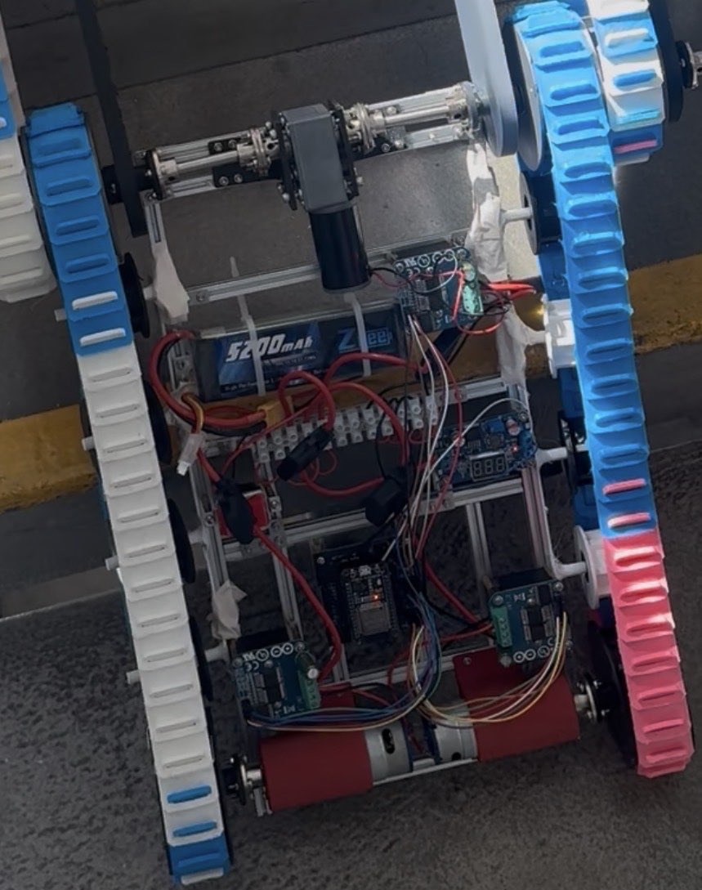
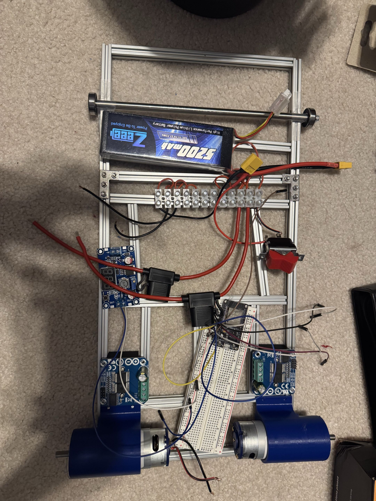
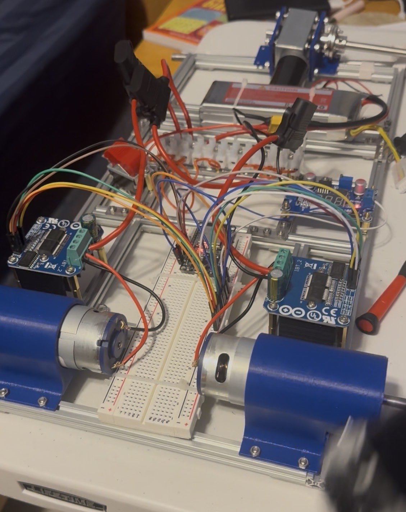
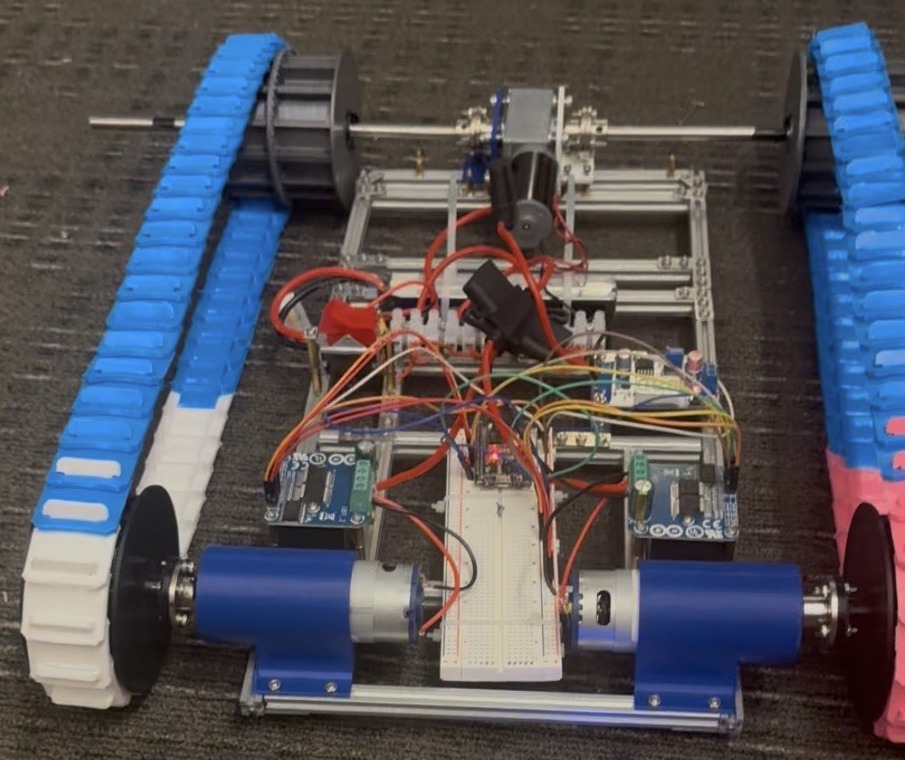

# ShotBot Electrical System

This directory contains the electrical design and documentation for **ShotBot**, a stair-climbing delivery robot developed as part of the Stanford Moonshot Club.

The electrical system was designed around a 3S LiPo battery, three independent BTS7960 motor-driver channels, an ESP32 DevKit, and a custom interconnect PCB. The system was developed incrementally through initial component layout, breadboard-based validation, PCB design, and final integration onto the robot.

The custom PCB and associated electrical architecture were successfully installed and operated on the ShotBot prototype.

---

## System Architecture

The electrical system is divided into two primary sections:

- **High-current motor power**, supplied directly from the battery rail through individually fused motor-driver branches
- **Low-voltage control electronics**, powered through an LM2596S buck converter and distributed through the custom interconnect PCB

### Power Architecture

ShotBot is powered by a **3S 5200 mAh LiPo battery** with a nominal voltage of 11.1 V and a maximum fully charged voltage of 12.6 V.

The battery is connected through a **master power switch** to positive and negative terminal blocks that form the main power-distribution rails.

Each major load is protected by an individual branch fuse.

| Branch | Protection | Load |
| --- | ---: | --- |
| Left drive | 20 A | BTS7960 + rear-left drive motor |
| Right drive | 20 A | BTS7960 + rear-right drive motor |
| Front / arm drive | 20 A | BTS7960 + front motor |
| Control electronics | 2 A | LM2596S + low-voltage electronics |

The terminal blocks provide centralized positive and ground distribution while minimizing exposed electrical connections. Most high-current connections are enclosed or terminated using screw terminals.

---

## Motor Control

ShotBot uses **three BTS7960 H-bridge motor-driver modules**, allowing the ESP32 to independently control three motor channels.

The drivers control:

1. Rear-left drive motor
2. Rear-right drive motor
3. Front / stair-climbing motor

The two rear drive motors are **ServoCity 118 RPM HD Premium Planetary Gear Motors**.

Each BTS7960 receives:

- Battery power from its individually fused branch
- 5 V logic power and ground
- PWM control signals from the ESP32
- Enable signals from the ESP32

The motor-driver current-sense connections were also routed in hardware as part of the electrical architecture.

---

## Low-Voltage Power System

A dedicated **2 A fused branch** supplies an LM2596S buck converter.

The buck converter reduces the battery voltage to **5 V** for the low-voltage control system.

The 5 V rail powers:

- ESP32 DevKit
- BTS7960 logic interfaces
- Custom interconnect PCB connections

The ESP32 provides the 3.3 V supply used by the MPU9250 IMU.

This arrangement separates the low-voltage control electronics from the high-current motor branches while maintaining a common electrical ground across the system.

---

## Custom Interconnect PCB

ShotBot uses a custom PCB to organize the electrical connections between the ESP32, motor drivers, IMU, and power system.

The board was designed in **Altium Designer** and was manufactured, installed, and successfully operated on the robot.

The PCB does not contain active control circuitry. Instead, it functions as an **interconnect and signal-distribution board**, replacing a large number of point-to-point wire connections with fixed PCB routing and labeled headers.

The board provides connections for:

- ESP32 DevKit
- Three BTS7960 motor drivers
- MPU9250 IMU
- 5 V logic power
- 3.3 V sensor power
- Common ground
- Motor-driver PWM signals
- Motor-driver enable signals
- Motor-driver current-sense signals
- I²C communication

The ESP32 mounts directly to header pins on the PCB, while labeled headers provide the external connections to the motor drivers and sensor.

Because the signal routing is defined directly by the PCB, the Altium schematic and PCB layout serve as the primary wiring and interconnect reference for the electrical system.

---

## PCB Design Files

The `pcb/` directory contains the design and fabrication files associated with the custom interconnect board.

### Source

`pcb/source/`

Contains the editable Altium project files, including:

- Altium PCB project
- PCB layout
- Schematic
- Fabrication output configuration

### Libraries

`pcb/libraries/`

Contains the custom Altium schematic-symbol and PCB-footprint libraries created for interfaces used by the interconnect board, including:

- ESP32 carrier
- BTS7960 motor drivers
- MPU9250 IMU

### Gerbers

`pcb/gerbers/`

Contains the Gerber and drill outputs used for PCB fabrication.

These include the relevant:

- Top and bottom copper layers
- Solder-mask layers
- Silkscreen / overlay layers
- Paste layers
- Mechanical / board-outline data
- Drill data

### PCB Images

`pcb/images/`

Contains visual documentation of the PCB, including Altium layout screenshots and 3D board views. These images allow the board design to be inspected without requiring Altium Designer.

---

## MPU9250 IMU

An **MPU9250 inertial measurement unit** was connected to the ESP32 over I²C using the SDA and SCL lines.

The IMU was electrically integrated and tested successfully, and valid sensor feedback was obtained from the device.

The sensor was originally intended to support more advanced robot-state estimation and future control capabilities. However, ShotBot ultimately operated as a remotely controlled platform, where IMU feedback provided limited practical benefit to the final control system.

The IMU therefore remained part of the electrical architecture but was not required for normal operation of the final remote-controlled version.

---

## Physical Implementation

### Final Electrical System

The final electrical system installed on ShotBot is shown below.

This implementation includes the battery power-distribution system, master power switch, motor drivers, buck converter, custom interconnect PCB, and ESP32 controller.

---

## Electrical Development Process

The electrical system was developed incrementally rather than being implemented directly as a finished PCB.

Development progressed through several stages:

1. Initial architectural component layout
2. Breadboard-based electrical integration
3. Functional testing of the ESP32 and motor-driver interfaces
4. Custom PCB design in Altium Designer
5. PCB fabrication and testing
6. Final integration onto the ShotBot prototype

### Initial Component Layout

The initial layout was used to establish the intended placement of the major electrical components before permanent integration onto the robot.

### Breadboard-Based Prototype

Before designing the custom PCB, the control system was assembled and validated using a breadboard-based prototype.

These early development stages were used to test the ESP32, motor-driver interfaces, power distribution, and overall system connectivity.

### Final PCB Integration

After validating the system architecture on the breadboard, the electrical wiring was consolidated onto the custom interconnect PCB and installed on the robot.

This reduced point-to-point wiring and provided a cleaner, more repeatable electrical implementation.

---

